## 代码功能说明   
### 21AGVinfantryGimbal:烧进舵轮云台（控制云台）  
### 21AGVinfantryChassis:烧进电流采样板（控制轮）  
### 21AGVinfantryCan:烧进底盘主控板（作为can中继板，控制舵）  
### 21AGVinfantryGimbal中保留有上述3个工程所需的SRML库，若SRML库有更新导致编译不通过，可以直接复制21AGVinfantryGimbal中的SRML文件夹再进行编译。  
### 21AGVinfantryrescue:烧进舵机控制板（控制舵机）  

## 舵轮步兵代码

### 底盘部分（电流采样板）：  
21AGVinfantryChassis  
从云台获取云台处理过的目标速度及各状态标志位、上传裁判系统与自瞄、发弹相关数据、功率控制、轮控制、UI绘制、向can板发目标速度

### 底盘部分（can板）：  
21AGVinfantryCan  
从电流采样板收获取处理过的can包，其中只有处理过的当前目标速度，并以此转换出舵角度值加以控制  
注意！两个底盘舵角度不同，请根据底盘类型以及代码中的注释进行增删
  
###	底盘部分（舵机控制板）：  
21AGVinfantryrescue  
用于维持舵机直立角度

### 云台：  
21AGVinfantryGimbal  
获取遥控数据、控制pitch、yaw、发射、下发处理过的目标速度及各状态标志位、获取底盘传来的裁判系统数据、自瞄数据通信 

###	测试数据：  
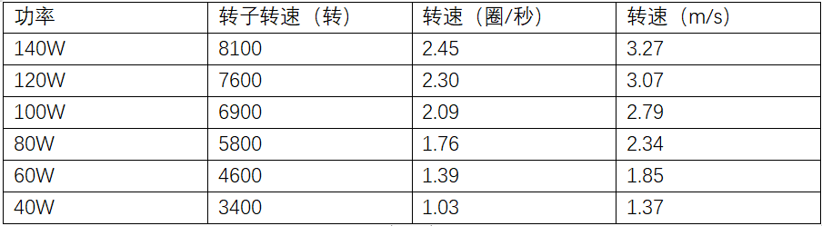   

 
## A  
  
## 依赖工具：keil  
### 软件环境：windows10  
### 硬件环境：STM32F407  
  
## B  
### 编译方式：C++编译   
  
## C  
### 文件目录结构及用途说明：  
文件整体目录：  
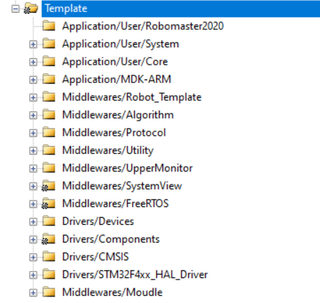    
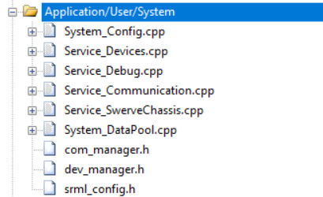    
该文件夹中的文件用于存放任务  
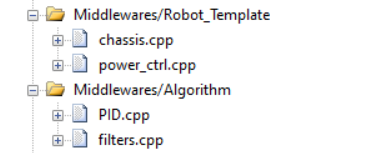    
RobotTemplate中的文件用于功率控制  
Algorithm中的文件用于pid计算及滤波  
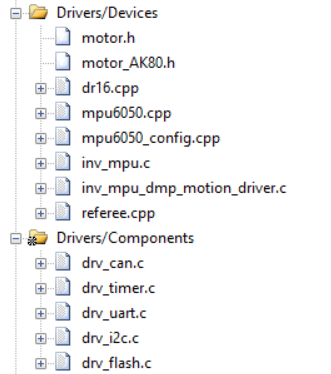   
Devices中的文件是封装好的陀螺仪库、裁判系统库、dr16库、电机库  
Components中的文件是封装好的外设库  
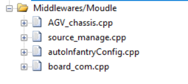   
Moudle中的文件是针对步兵的需要编写的函数文件

## D  
### 软件框图：  
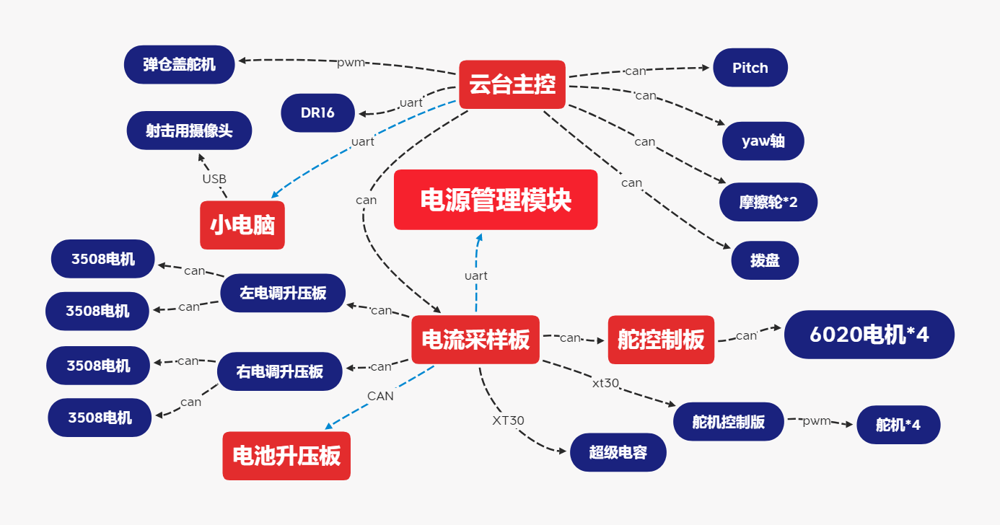  
### 硬件框图：  
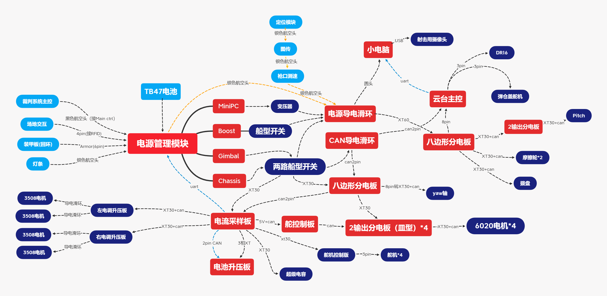  

## E  
### 原理介绍：  
舵轮解算：  
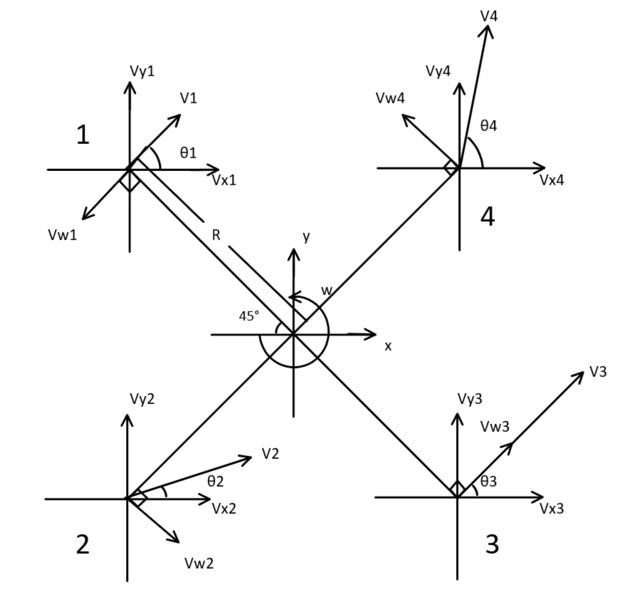  
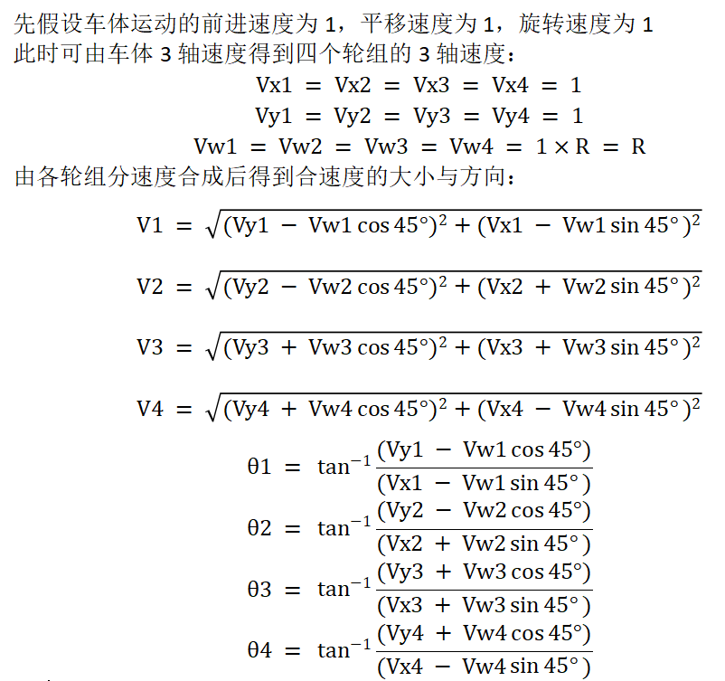    

## F  
### 软件架构：  
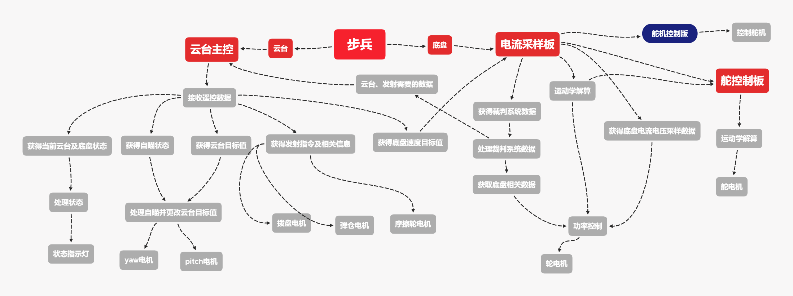    

## G  
### 未来优化方向：  
未来电控底盘方面还可就功率控制方面进行优化，如配合硬件减小输出纹波以达到获得最大输出力矩的目的  
云台方面可以尝试更多的控制方法来加快云台响应速度

